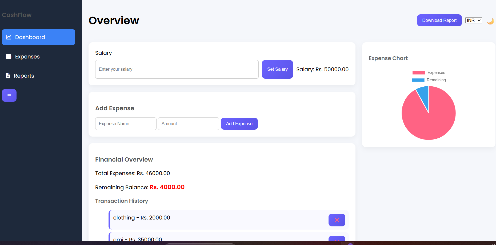
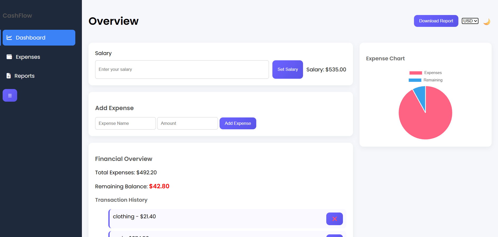
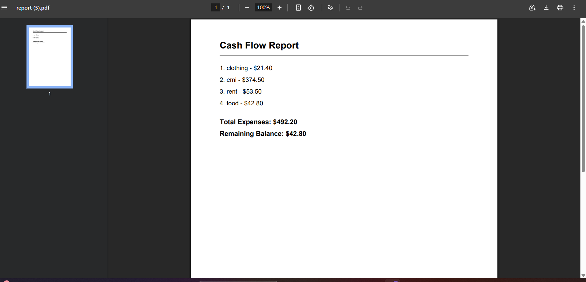
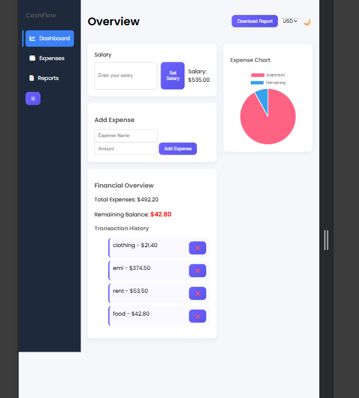

#  Cash Flow Tracker Dashboard

##  Overview

The Cash Flow Tracker Dashboard is a responsive web application designed to help users manage their personal finances efficiently. It allows users to input their salary, track expenses, monitor remaining balance, and visualize financial data through an interactive chart.

This project focuses on building a clean dashboard UI while implementing core JavaScript concepts such as DOM manipulation, data persistence, and real-time updates.


##  Features

* Add and display total salary
* Add, view, and delete expenses dynamically
* Real-time calculation of total expenses and remaining balance
* Data persistence using LocalStorage (data saved after refresh)
* Interactive Pie Chart visualization (Expenses vs Remaining Balance)
* Currency conversion (INR ↔ USD) using API
* PDF report generation for expense summary
* Budget alert when remaining balance drops below 10%
* Responsive dashboard layout with sidebar navigation
* Dark mode toggle 🌙
* Smooth animations and hover effects

---

##  Technologies Used

* **HTML5** – Semantic structure
* **CSS3** – Flexbox, layout design, animations
* **JavaScript (Vanilla JS)** – Application logic and DOM handling
* **Chart.js** – Data visualization (Pie Chart)
* **jsPDF** – PDF generation
* **LocalStorage** – Client-side data persistence
* **Exchange Rate API** – Currency conversion

---

##  Screenshots

### Desktop View

Dashboard Overview INR


Dashboard Overview USD


Expenses Download Report 



###  Mobile View

Mobile Dashboard


---

##  Project Structure

CashFlowDashboard/
│── index.html        → Main HTML structure
│── cashflow.css      → Styling and layout
│── cashflow.js       → Application logic
│── images/           → Screenshots and assets
│── README.md 
│── prompts.md 

---

##  How to Run the Project

1. Clone the repository:

   ```bash
   git clone https://github.com/yourusername/cash-flow-tracker.git
   ```

2. Open the project folder

3. Run the project:

    Open `index.html` in your browser


##  Live Demo

https://anucodeverse.github.io/CashFlowDashboard/


##  Technical Learnings

* Handling dynamic DOM updates efficiently
* Managing application state using JavaScript
* Implementing LocalStorage for persistent data
* Integrating third-party libraries (Chart.js, jsPDF)
* Working with APIs for real-time data conversion
* Designing responsive dashboard layouts


##  Challenges Faced

* Pie chart not rendering correctly after reload
* Handling currency symbol display dynamically
* Fixing encoding issues in PDF (₹ symbol problem)
* Managing UI updates without breaking chart rendering
* Aligning dashboard layout for a professional look


##  Future Improvements

* Add backend integration (Node.js / Database)
* User authentication system
* Advanced analytics (monthly reports)
* Multiple currency support
* Export data as CSV/Excel


##  Note

This project is built using **pure HTML, CSS, and JavaScript** without using any frameworks like React or Bootstrap.
The main goal was to strengthen core frontend development skills and build a real-world dashboard application.


**Your Name**
GitHub: https://github.com/yourusername

---
